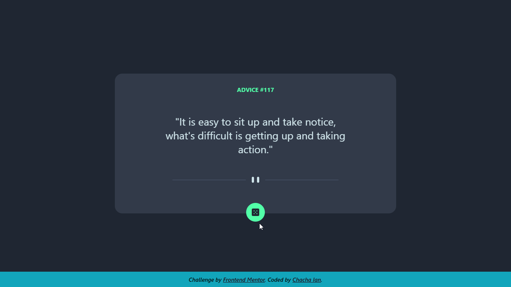

# Frontend Mentor - Advice generator app solution

This is a solution to the [Advice generator app challenge on Frontend Mentor](https://www.frontendmentor.io/challenges/advice-generator-app-QdUG-13db). Frontend Mentor challenges help you improve your coding skills by building realistic projects.

## Table of contents

- [Overview](#overview)
  - [The challenge](#the-challenge)
  - [Screenshot](#screenshot)
  - [Links](#links)
- [My process](#my-process)
  - [Built with](#built-with)
- [Author](#author)
- [Acknowledgments](#acknowledgments)

## Overview
It was enjoyable for me going about and completing this challenge by myself. It took me only a day. I used the [Advice Slip API](https://api.adviceslip.com) to completete this challenge. Requests are made using JavaScript's Fetch API and everything else is built using HTML, CSS and JavaScript.

### The challenge

Users should be able to:

- View the optimal layout for the app depending on their device's screen size
- See hover states for all interactive elements on the page
- Generate a new piece of advice by clicking the dice icon

### Screenshot

The screenshot of my solution

### Links

- Solution URL: [Add solution URL here](https://your-solution-url.com)
- Live Site URL: [Add live site URL here](https://your-live-site-url.com)

## My process

### Built with

- Semantic HTML5 markup
- CSS custom properties
- Flexbox
- CSS Grid
- Mobile-first workflow
- JavaScript
- Fetch API

## Author

- Website - [Chacha Ian (Github)](https://github.com/Dezynre)
- Frontend Mentor - [@yourusername](https://www.frontendmentor.io/profile/Dezynre)
- Twitter - [@yourusername](https://www.twitter.com/ExpertChurcher)
